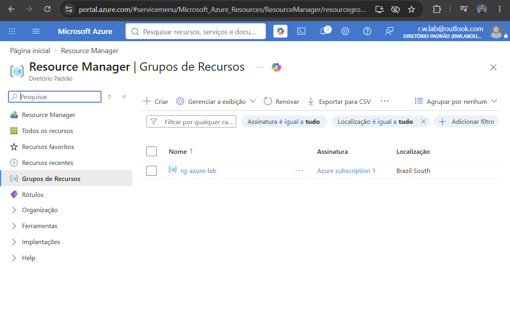
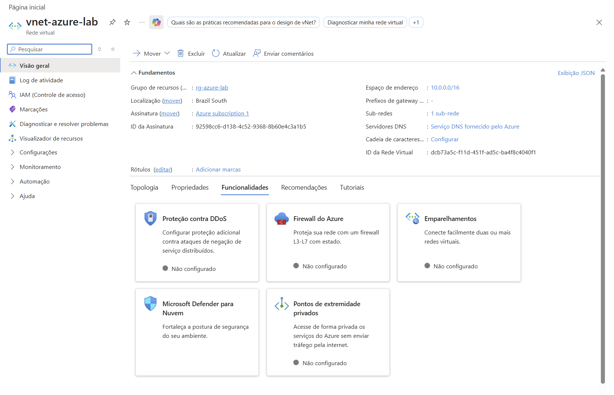
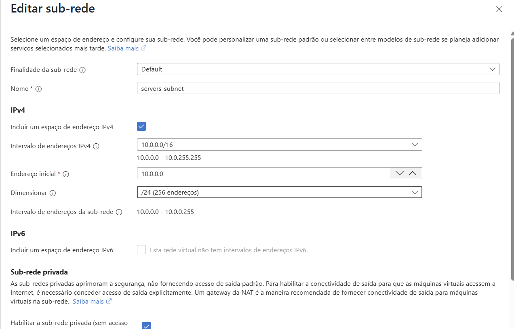
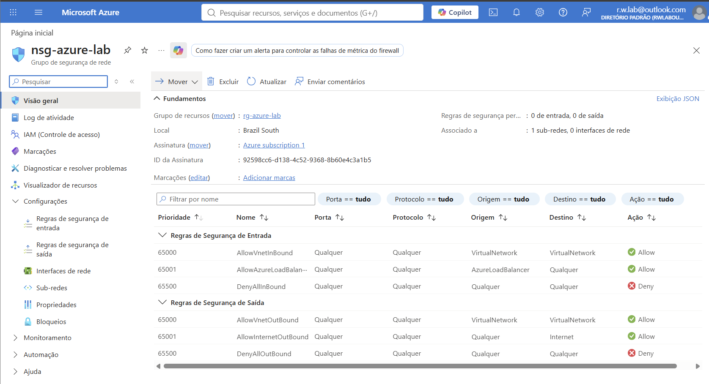
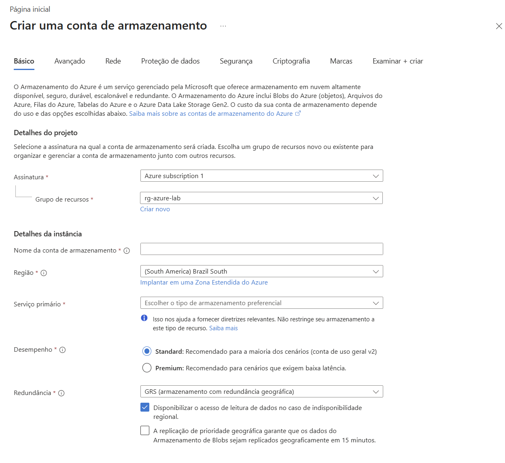
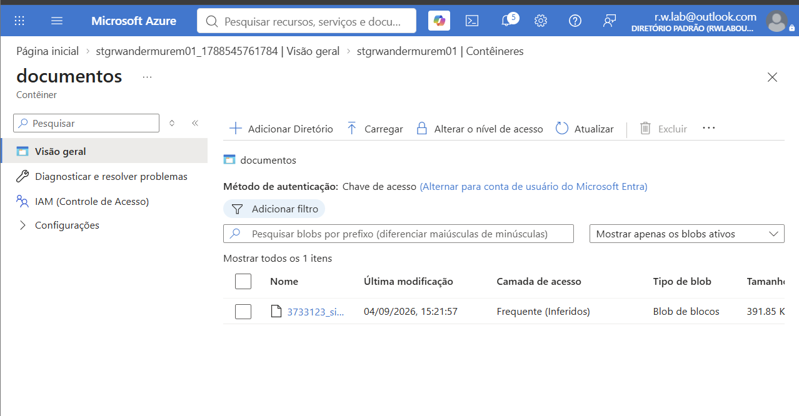

# Azure Lab 01 - Fundamentos Azure

## 📌 Sobre o Projeto

Este laboratório foi desenvolvido com o objetivo de praticar os conceitos fundamentais do Microsoft Azure, explorando serviços essenciais de rede, armazenamento e segurança em nuvem.

O ambiente foi criado utilizando uma assinatura Azure Trial e serviu como primeiro contato prático com a plataforma Azure, complementando os estudos para a certificação **AZ-900: Microsoft Azure Fundamentals**.

---

# 🎯 Objetivos

- Criar e gerenciar recursos no Microsoft Azure.
- Compreender a função dos Resource Groups.
- Implementar uma Virtual Network (VNet).
- Configurar Subnets.
- Configurar segurança utilizando Network Security Groups (NSG).
- Criar e utilizar uma Storage Account.
- Utilizar Azure Blob Storage para armazenamento de arquivos.

---

# 🏗️ Arquitetura do Ambiente

```text
Azure Subscription
│
└── rg-azure-lab
    │
    ├── vnet-azure-lab
    │   └── servers-subnet
    │        └── nsg-azure-lab
    │
    └── Storage Account
         └── Blob Storage
              └── Container: documentos
```

---

# 📂 Resource Group

Criação do grupo de recursos responsável por organizar todos os componentes do laboratório.



---

# 🌐 Virtual Network (VNet)

Implementação de uma rede virtual para segmentação e comunicação entre recursos Azure.

Configuração utilizada:

- Rede Virtual: `vnet-azure-lab`
- Espaço de Endereçamento: `10.0.0.0/16`



---

# 🔀 Subnet

Criação da subnet destinada aos recursos do ambiente.

Configuração utilizada:

- Nome: `servers-subnet`
- Faixa de Endereços: `10.0.1.0/24`



---

# 🔒 Network Security Group (NSG)

Criação e associação de um NSG à subnet para controle de tráfego e aplicação de regras de segurança.

Conceitos praticados:

- Segurança de rede
- Controle de acesso
- Regras de entrada e saída
- Segmentação de rede



---

# 💾 Storage Account

Criação de uma conta de armazenamento para utilização dos serviços de armazenamento Azure.

Conceitos praticados:

- Azure Storage
- Redundância de dados
- Armazenamento em nuvem
- Blob Storage



---

# 📁 Azure Blob Storage

Criação de um contêiner privado para armazenamento de arquivos.

Atividades realizadas:

- Criação do contêiner **documentos**
- Upload de arquivo PDF
- Gerenciamento de objetos Blob



---

# 📚 Conceitos Aprendidos

Durante o desenvolvimento deste laboratório foram praticados os seguintes conceitos:

- Cloud Computing
- Microsoft Azure
- Azure Resource Manager (ARM)
- Resource Groups
- Azure Networking
- Virtual Networks
- Subnets
- Azure Storage
- Blob Storage
- Network Security Groups (NSG)
- Segurança em Nuvem

---

# ✅ Resultados Obtidos

- Ambiente Azure configurado com sucesso.
- Rede virtual criada e segmentada por subnet.
- NSG associado à infraestrutura de rede.
- Conta de armazenamento provisionada.
- Upload de arquivos realizado utilizando Azure Blob Storage.
- Familiarização com o Portal Azure e gerenciamento de recursos.

---


# 👨‍💻 Autor

**Richardson Wandermurem**

🔗 LinkedIn: https://www.linkedin.com/in/richardsonwandermurem/


